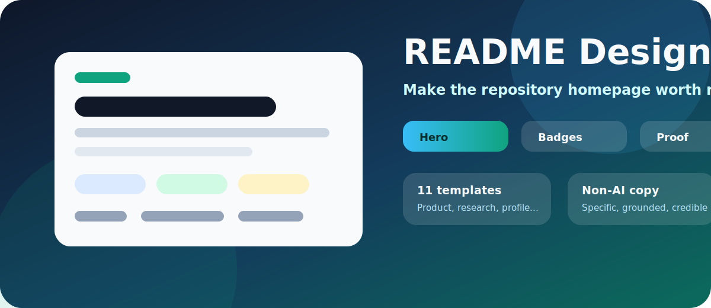

<div align="center">
  
  <h1>README Design Skill</h1>
  <p><strong>把 GitHub README 当成项目首页来设计，而不是当成说明书来堆内容。</strong></p>
  <p>
    <a href="./skills/readme-design/SKILL.md">Skill</a>
    ·
    <a href="./skills/readme-design/assets/templates/default.md">Default Template</a>
    ·
    <a href="./skills/readme-design/assets/templates/README.md">Template Gallery</a>
    ·
    <a href="./skills/readme-design/references/patterns.md">Design Patterns</a>
  </p>
  <p>
    
    
    
    
  </p>
</div>

---

## Why This Exists

Most open-source READMEs fail in the same quiet way: the project may be useful, but the first screen does not say what it is, who it helps, where to try it, or why anyone should trust it.

`readme-design` gives Codex a repeatable design workflow for README homepages: stronger first screens, cleaner proof, better screenshots, useful badges, grounded copywriting, and templates that render well on GitHub.

## Standard README Anatomy

| # | Section | Purpose |
| --- | --- | --- |
| 1 | Hero | Name, logo, one-sentence positioning |
| 2 | Badges | Status, license, docs, release, stars, platform |
| 3 | Primary Links | Demo, GitHub Pages, docs, download, paper, examples |
| 4 | Visual Proof | Screenshot, architecture map, preview, result sample |
| 5 | Highlights | 3-6 concrete capabilities tied to user value |
| 6 | Quick Start | Install and run with the shortest honest path |
| 7 | Usage | Commands, examples, input/output, recipes |
| 8 | Structure | File map only when it helps navigation |
| 9 | Roadmap | Current state, next work, planned direction |
| 10 | Trust | Star History, contribution guide, license, FAQ |
| + | Activity Overview | Contribution-type distribution for profile/contributor READMEs |

## Template Gallery

| Template | Best For | First Impression |
| --- | --- | --- |
| [Default](./skills/readme-design/assets/templates/default.md) | General high-quality README | Complete homepage skeleton |
| [Product Showcase](./skills/readme-design/assets/templates/styles/01-product-showcase.md) | Apps and browser extensions | Visual, workflow-first, screenshot-ready |
| [Research Roadmap](./skills/readme-design/assets/templates/styles/02-research-roadmap.md) | Research, roadmaps, paper collections | Topic map and output center |
| [Library Docs](./skills/readme-design/assets/templates/styles/03-library-docs.md) | Packages, SDKs, APIs | Install, example, API table |
| [Profile Portfolio](./skills/readme-design/assets/templates/styles/04-profile-portfolio.md) | GitHub profile README | Personal identity and featured work |
| [Awesome Curation](./skills/readme-design/assets/templates/styles/05-awesome-curation.md) | Curated lists | Category index and selection rules |
| [Activity Overview](./skills/readme-design/assets/templates/styles/06-profile-activity-overview.md) | Contributor-focused profiles | Contribution mix chart |
| [Startup Landing](./skills/readme-design/assets/templates/styles/07-startup-landing.md) | Early products | Problem, product, why now |
| [Course Tutorial](./skills/readme-design/assets/templates/styles/08-course-tutorial.md) | Tutorials and courses | Learning path and outputs |
| [Bilingual Global](./skills/readme-design/assets/templates/styles/09-bilingual-global.md) | Chinese projects going global | English/Chinese paired structure |
| [Minimal Technical](./skills/readme-design/assets/templates/styles/10-minimal-technical.md) | Infra and devtools | Precise, restrained, technical |

## What The Skill Cares About

- **First screen clarity**: a visitor should understand the project in 10 seconds.
- **README logo / wordmark**: product-like repos should get a small original top identity when they do not already have one.
- **Visual evidence**: screenshots, diagrams, result previews, or structured examples.
- **Trust signals**: badges, Star History, license, contribution path, and real status.
- **Non-AI copy**: fewer vague claims, more concrete objects, workflows, outputs, and constraints.
- **GitHub-safe design**: Markdown, tables, Mermaid, shields, and conservative HTML that GitHub actually renders.

## Install

Copy the skill folder into your Codex skills directory:

```text
skills/readme-design -> ~/.codex/skills/readme-design
```

In this workspace, the installed skill lives at:

```text
C:\Users\harzva\.codex\skills\readme-design
```

## Example Prompts

```text
Use $readme-design to redesign this repository README into a polished GitHub homepage.
```

```text
Use $readme-design and the research-roadmap template to make this project feel like a serious public knowledge base.
```

```text
Use $readme-design to remove AI-ish copy, add visual proof, and make the first screen more convincing.
```

## References

- [awesome-github-profile-readme-chinese](https://github.com/eryajf/awesome-github-profile-readme-chinese)
- [Anthropic frontend-design skill](https://github.com/anthropics/skills/blob/main/skills/frontend-design)

## License

MIT
