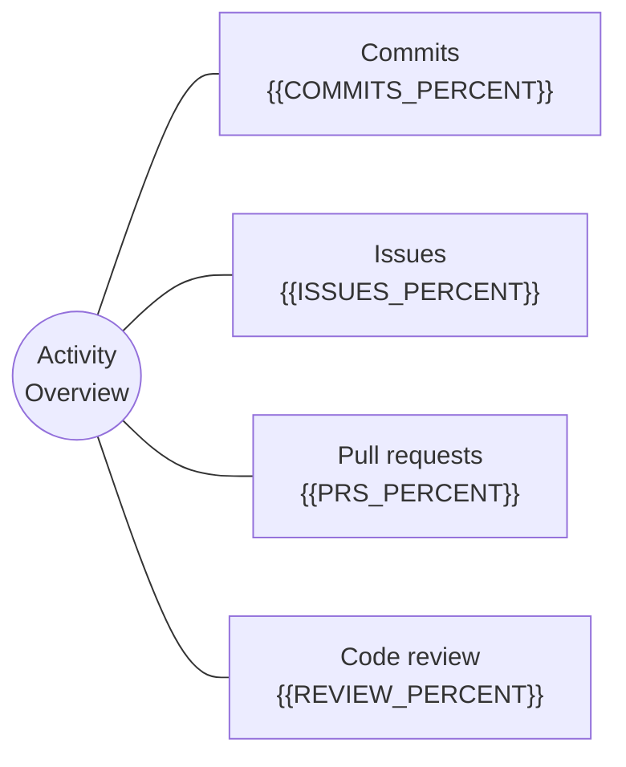

<div align="center">
  <h1>{{PROJECT_NAME}}</h1>
  <p><strong>{{ONE_SENTENCE_POSITIONING}}</strong></p>
  <p>{{SHORT_CONTEXT_LINE_WITH_AUDIENCE_OR_SCOPE}}</p>

  <p>
    <a href="{{DEMO_URL}}">Live Demo</a>
    ·
    <a href="{{DOCS_URL}}">Docs</a>
    ·
    <a href="{{DOWNLOAD_URL}}">Download</a>
    ·
    <a href="{{CHANGELOG_URL}}">Changelog</a>
  </p>

  <p>
    
    
    
  </p>
</div>

---

<p align="center">
  
</p>

## Why This Exists

- {{USER_PAIN_OR_OPPORTUNITY_1}}
- {{USER_PAIN_OR_OPPORTUNITY_2}}
- {{USER_PAIN_OR_OPPORTUNITY_3}}

## Highlights

| Area | What It Does | Why It Matters |
| --- | --- | --- |
| {{FEATURE_AREA_1}} | {{FEATURE_1}} | {{VALUE_1}} |
| {{FEATURE_AREA_2}} | {{FEATURE_2}} | {{VALUE_2}} |
| {{FEATURE_AREA_3}} | {{FEATURE_3}} | {{VALUE_3}} |

## Quick Start

```bash
{{INSTALL_COMMAND}}
{{RUN_COMMAND}}
```

## Usage

```bash
{{EXAMPLE_COMMAND}}
```

```text
{{EXPECTED_OUTPUT_OR_RESULT}}
```

## Project Structure

```text
{{REPO}}/
├─ docs/
├─ src/
├─ assets/
└─ README.md
```

## Roadmap

| Stage | Status | Scope |
| --- | --- | --- |
| v0.1 | Done | {{DONE_SCOPE}} |
| v0.2 | Doing | {{DOING_SCOPE}} |
| v0.3 | Planned | {{PLANNED_SCOPE}} |

## Star History

[](https://star-history.com/#{{OWNER}}/{{REPO}}&Date)

## Activity Overview

Use this section when contribution mix is part of the story. Keep the numbers honest; update them manually or remove the section.



## Contributing

Contributions are welcome. Please open an issue first for large changes so the direction stays clear.

## License

Released under the {{LICENSE_NAME}} License.
