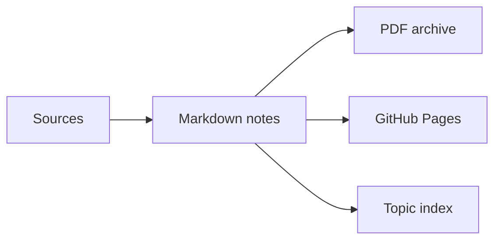

<!-- Research/roadmap README template. Replace the sample scope with your own. -->

  <h1>ChinaAI Roadmaps</h1>
  
<strong>GLM, Kimi, DeepSeek, MiniMax and other Chinese AI companies through papers, releases, products, and engineering signals.</strong>

  

    <a href="https://example.com">GitHub Pages</a>
    ·
    <a href="./papers">Paper Index</a>
    ·
    <a href="./dist/pdf">PDF Downloads</a>
    ·
    <a href="./roadmaps">Roadmaps</a>
  

  

    
    
    
  

## Online Access

| Entry | Link | Best For |
| --- | --- | --- |
| Site | `https://example.com` | Reading and navigation |
| Markdown | `./roadmaps` | Source review and edits |
| PDF | `./dist/pdf` | Sharing and archive |

## Topic Map

| Company | Current Focus | Artifacts | Status |
| --- | --- | --- | --- |
| GLM | Agent and model stack | Roadmap, papers, releases | Updating |
| Kimi | Long-context productization | Roadmap, product notes | Updating |
| DeepSeek | open model and reasoning line | Papers, code links | Active |
| MiniMax | multimodal and product stack | Roadmap, release notes | Drafting |

## Method

1. Track public papers, repositories, releases, talks, and product updates.
2. Extract model lineage, architecture choices, evaluation signals, and product direction.
3. Compare companies without forcing them into the same narrative.

## Output Formats

## Update Plan

| Cadence | What Changes |
| --- | --- |
| Weekly | New links, releases, and paper updates |
| Monthly | Roadmap synthesis and company comparison |
| Quarterly | Deep report and archive cleanup |
