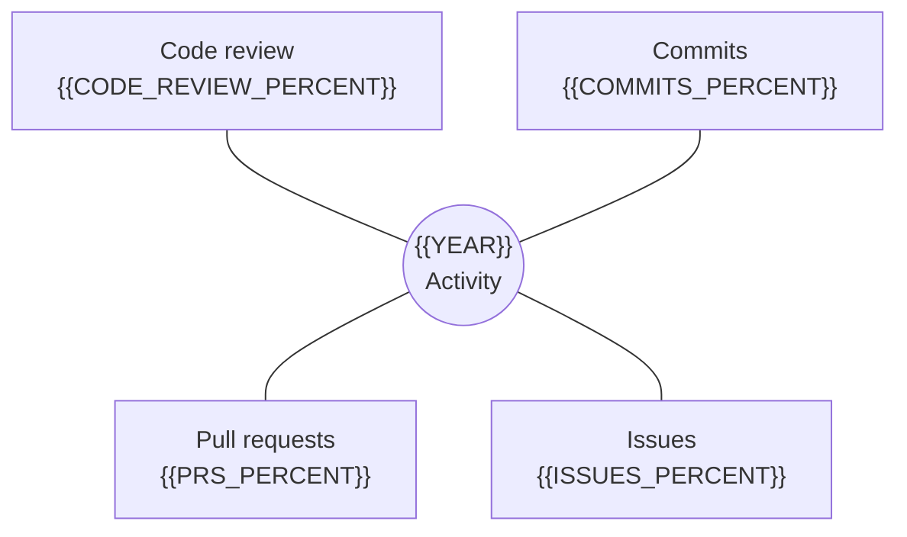

<h1 align="center">{{NAME}}</h1>

  <strong>{{IDENTITY_LINE}}</strong>

  <a href="{{WEBSITE_URL}}">Website</a>
  ·
  <a href="{{RESUME_URL}}">Resume</a>
  ·
  <a href="{{CONTACT_URL}}">Contact</a>

## Activity Overview

This profile emphasizes contribution mix, not just total activity. Update the values manually or remove the chart when the numbers are stale.

| Contribution Type | Share | Notes |
| --- | --- | --- |
| Commits | {{COMMITS_PERCENT}} | {{COMMITS_NOTE}} |
| Pull requests | {{PRS_PERCENT}} | {{PRS_NOTE}} |
| Issues | {{ISSUES_PERCENT}} | {{ISSUES_NOTE}} |
| Code review | {{CODE_REVIEW_PERCENT}} | {{REVIEW_NOTE}} |

## Work I Care About

- {{CARE_1}}
- {{CARE_2}}
- {{CARE_3}}

## Featured Repositories

| Repository | Focus | Signal |
| --- | --- | --- |
| [{{REPO_1}}]({{REPO_1_URL}}) | {{REPO_1_FOCUS}} | {{REPO_1_SIGNAL}} |
| [{{REPO_2}}]({{REPO_2_URL}}) | {{REPO_2_FOCUS}} | {{REPO_2_SIGNAL}} |

## Recent Writing

- [{{POST_1}}]({{POST_1_URL}})
- [{{POST_2}}]({{POST_2_URL}})
