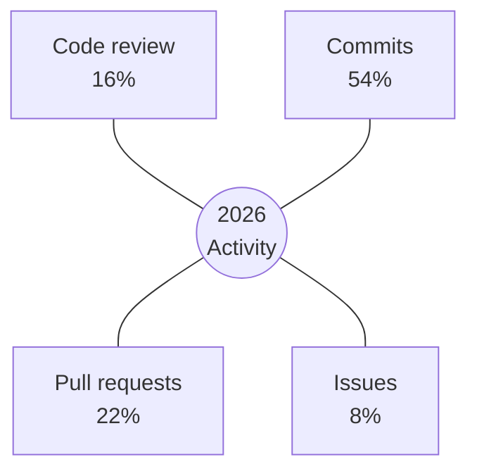

<!-- Profile README template with Activity Overview / contribution distribution. -->

<h1 align="center">Maya Lin</h1>

  <strong>Open-source builder focused on developer tools, review systems, and practical AI workflows.</strong>

  <a href="https://example.com">Website</a>
  ·
  <a href="https://example.com/resume.pdf">Resume</a>
  ·
  <a href="mailto:hello@example.com">Contact</a>

## Activity Overview

This section tells a story about contribution style. Update the numbers manually or remove the chart if it becomes stale.

| Contribution Type | Share | What It Says |
| --- | --- | --- |
| Commits | 54% | Hands-on implementation across active repositories |
| Pull requests | 22% | Frequent integration and collaboration work |
| Code review | 16% | Review-heavy maintenance and project stewardship |
| Issues | 8% | Focused triage rather than noisy discussion |

## Work I Care About

- Tools that make review and documentation easier.
- Small systems that help teams remember decisions.
- AI workflows that preserve engineering quality.

## Featured Repositories

| Repository | Focus | Signal |
| --- | --- | --- |
| `review-lab` | Pull request review workflows | Used across internal projects |
| `docs-radar` | Documentation quality checks | Converts docs drift into issues |
| `ai-notes-kit` | Reusable AI session notes | Helps long-running work resume cleanly |
