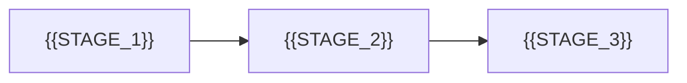

# {{PROJECT_NAME}}

{{ONE_LINE_TECHNICAL_DESCRIPTION}}

```text
{{INPUT}} -> {{PROCESS}} -> {{OUTPUT}}
```

## Install

```bash
{{INSTALL_COMMAND}}
```

## Usage

```bash
{{USAGE_COMMAND}}
```

## Design Goals

- {{GOAL_1}}
- {{GOAL_2}}
- {{GOAL_3}}

## Non-Goals

- {{NON_GOAL_1}}
- {{NON_GOAL_2}}

## Configuration

| Option | Default | Description |
| --- | --- | --- |
| `{{OPTION_1}}` | `{{DEFAULT_1}}` | {{DESC_1}} |
| `{{OPTION_2}}` | `{{DEFAULT_2}}` | {{DESC_2}} |

## Internals



## License

{{LICENSE_NAME}}
